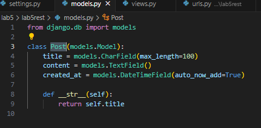
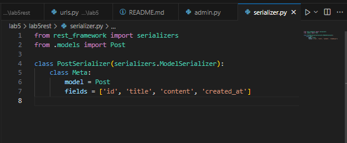
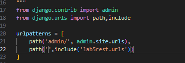
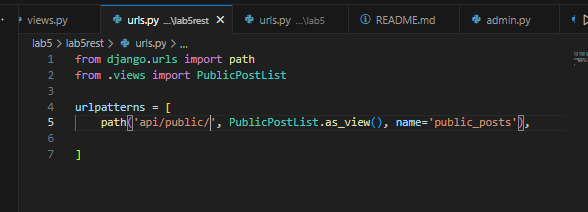
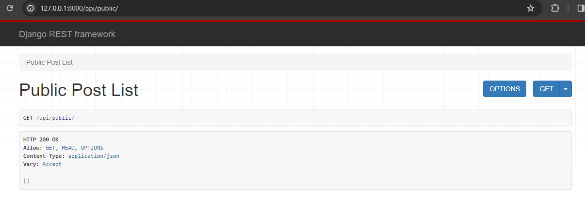

Steps to Build the API
1. Installation of Django REST Framework
To start building the API, Django REST Framework was installed using the following command:

```bash
pip install djangorestframework
```
2. Configuration in settings.py
    In the settings.py file, the following configurations were added:

```python

INSTALLED_APPS = [
    # ... other installed apps
    'rest_framework',
    'lab5rest'
]

DEFAULT_PERMISSION_CLASSES = [
    'rest_framework.permissions.AllowAny',
]
```
3. Model and Serializer Setup
The models.py file was created to define the data structure for posts, and a corresponding serializer (serializer.py) was implemented to handle the conversion between complex data types, such as Django querysets, and native Python datatypes.

**models.py**



**Serializers.py**



4. API Views and URL Configuration
API views were defined in apiviews.py, where a class-based view, PublicPostList, was created to handle public posts. The URL routing was configured in urls.py to map the views to specific endpoints.





5. Database Migration
The initial migration for the database was performed using the following commands:

```bash
python manage.py makemigrations
python manage.py migrate
```
6. Running the Development Server
To test the API, the Django development server was started:

```bash
python manage.py runserver
```
Visit http://127.0.0.1:8000/api/public/ to ensure the API is working as expected.


